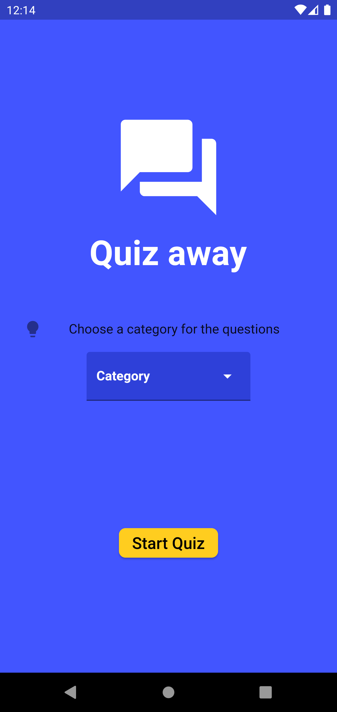
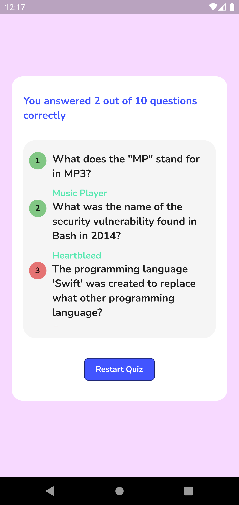

# Quiz App

A Flutter quiz app that allows users to select a category and answer trivia questions from the Open Trivia Database.

## Features

- Choose from a variety of trivia categories.
- Test your knowledge with multiple-choice questions.
- Keep track of your score and progress.
- Fetch questions from the Open Trivia Database API.

## Screenshots

<table>
  <tr>
    <td>Onboarding</td>
    <td>Questions</td>
    <td>Results</td>
  </tr>
  <tr>
    <td></td>
    <td></td>
    <td></td>
  </tr>
 </table>

## Contributing

Contributions are welcome! Here are some ways you can contribute to this project:

- Submit bug reports or feature requests.
- Fix bugs and submit pull requests.
- Add new features or improve existing ones.

### Development Setup

1. Install [Flutter](https://flutter.dev/docs/get-started/install) on your machine.
2. Clone this repository: `git clone https://github.com/sreenath-kp/Quiz-away.git`.
3. Navigate to the project directory: `cd Quiz-away`.
4. Install dependencies: `flutter pub get`.
5. Run the app: `flutter run`.

